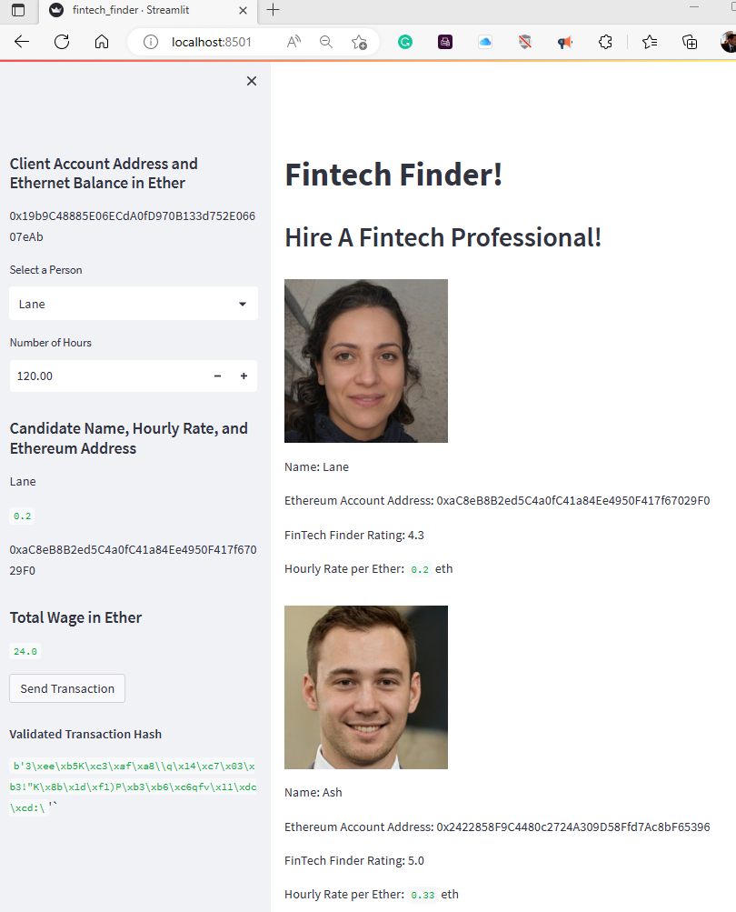

# Crypto Payment App for FinTech Professionals
This application uses blockchain technology to transact cryptocurrency payments to fintech professionals.

---
<!--Purpose -->
## Purpose

### Inputs:
- Pychain requests the following transactional data: 
    - Select the employee to pay
    - Enter hours worked
    
    
- Pychain Ledger
        - Low
        - Medium
        - High

### Process:
-  `fintech_finder.py`
    - This application contains the web 3 interface functions that are visible when running Streamlit

- `cryto_wallet.py`
    - This file contains the Ethereum transaction functions. It uses import statements, to integrate this `crypto_wallet.py` Python script into the Fintech Finder interface program that is found in the `fintech_finder.py` file.

### Outputs
- Block Inspector
    - Features:

        - FinTech Employee Ethereum rate
        - Rate calculation in Ether
        - Validation Transaction Hash
       
 
---
<!--Technologies -->
## Technologies
### Python:

    Phyton Version: **3.7.13**

### Streamlit
[streamlit](https://streamlit.io/)

### Web 3
[web3](https://ethereum.org/en/web3/)

---
<!--How to run -->
## Import Streamlit
    pip install streamlit

## Run the Streamlit application
    streamlit run pychain.py

## Demo Video
Watch it on [youtube](https://youtu.be/2GPO9k_2Rg0)

---
<!--Demo -->
### Run Streamlit from Git Bash

### App: Fintech Finder (web view)

### Ganache Account

### Ganache Transaction Record

### Validated Record (See Validated Transaction Hash)

---
<!--Version Release -->
## Version Release

### Version 1.2
-   Updated code, fixed error message with web-3
-   Tested 12/25/22
-   Demo recorded and uploaded to YouTube

---
<!--Contributors -->
## Contributors

Jeremy Vargas

    Managing Director
    Resonant Solutions LLC
    email:    jeremyvargas@resonantsolutions.org
    linkedin: https://www.linkedin.com/in/jeremyvargas/

UW FinTech Bootcamp
- Startup code provided by institution

---
<!--License -->
## License
Tool is available under an MIT License.

Copyright (c) 2022 - Resonant Solutions, LLC

### Permissions
Permission is hereby granted, free of charge, to any person obtaining a copy of this software and associated documentation files (the “Software”), to deal in the Software without restriction, including without limitation the rights to use, copy, modify, merge, publish, distribute, sublicense, and/or sell copies of the Software, and to permit persons to whom the Software is furnished to do so, subject to the following conditions:

The above copyright notice and this permission notice shall be included in all copies or substantial portions of the Software.
### Disclaimer
The Software is provided “as is”, without warranty of any kind, express or implied, including but not limited to the warranties of merchantability, fitness for a particular purpose and noninfringement. In no event shall the authors or copyright holders be liable for any claim, damages or other liability, whether in an action of contract, tort or otherwise, arising from, out of or in connection with the software or the use or other dealings in the Software.

---
<!--Aknowledgements -->
## Aknowledgements
* [Markdown Guide](https://www.markdownguide.org/basic-syntax/#reference-style-links)

<!-- MARKDOWN LINKS & IMAGES -->
<!-- https://www.markdownguide.org/basic-syntax/#reference-style-links -->